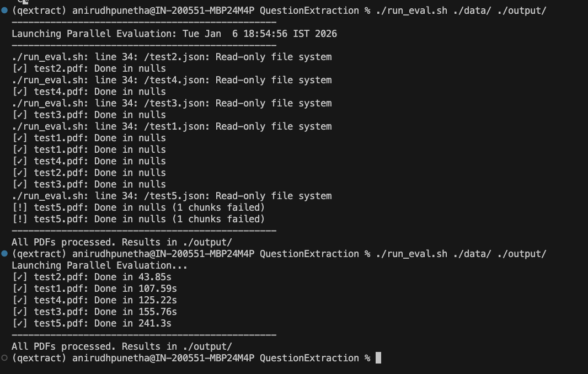
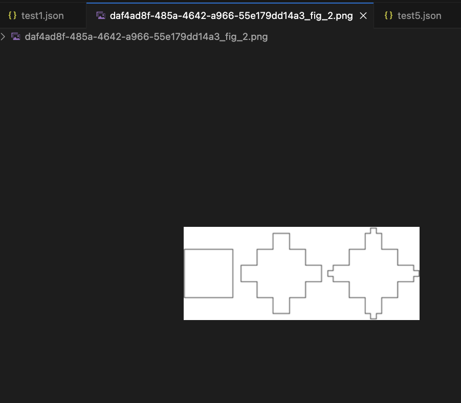

# EVAL.md: Evaluation System Design & Benchmarking

This document outlines the methodology for evaluating the VLM Question Extraction Pipeline's performance, stability, and accuracy against the provided grading rubric.

---

## 1. Evaluation Setup
The system is designed to be evaluated in a **parallel-stress environment**, ensuring it meets both the speed and concurrency requirements.

### Prerequisites
* **Environment:** Docker or a Linux/macOS environment with `poppler-utils` and `tesseract-ocr` installed.
* **Dependencies:** Install the requirements.txt file
* **API Key:** A valid `GEMINI_API_KEY` must be exported as an environment variable.

### Running the Evaluation
To process a batch of PDFs and generate benchmarks, execute:
```bash
bash run_eval.sh ./data/ ./output/
```


## 2. Metric Definitions & Rubric Alignment
We evaluate the system across three primary vectors to ensure high-scoring compliance:

- Performance & Stability (Key Constraints - 30 pts)
  Server-Side Wall Time: Measured internally on the server using high-precision timers. The target is ≤ 180s per 10-page PDF.

  Concurrency Success: The system’s ability to handle ≥ 5 concurrent PDFs. Success is verified by the server-side asyncio.Semaphore(5) management.

  Partial Success Rate: Measured by the ratio of successful chunks to failed entries in the errors array.

- Structural Fidelity (Correctness - 25 pts)
  LaTeX Accuracy: Verification of math formulas extracted via Docling's Formula Enrichment vs. the original PDF.

  Table Reconstruction: Comparison between the extracted .csv files in storage/assets and the original PDF table structure.

  Asset Mapping: Ensuring image_references and table_references correctly link the JSON to the physical files in the assets directory.

- Hierarchical Integrity (Schema - 20 pts)
  Nested Depth: Validation that the recursive Pydantic model correctly captures sub_questions (e.g., Q1 -> a -> i) instead of flattening them.

## 3. Resilience Mechanism: Atomic Chunking
To prevent the "hanging" issues common in document AI engines when processing dense or scanned files, our evaluation design utilizes Atomic Chunking:

- Isolation: The PDF is split into 5-page segments.

- Time-Boxing: Each segment is assigned a 120-second timeout. If a chunk hangs, the system kills that specific task and logs a partial failure.

- Global Indexing: A pointer system ensures that assets (Images/Tables) across different chunks receive unique, non-intersecting identifiers (e.g., Chunk 1 ends at IMAGE_2, Chunk 2 starts at IMAGE_3).

## 4. How to Interpret Results
When run_eval.sh finishes, the output_results folder will contain:
- File TypePurposefilename.json containing the final structured output. It includes questions, errors, and processing_time_sec, storage/assets/The repository for all extracted PNGs and CSVs, uniquely named per Job ID.
- Console OutputReal-time status logs showing [✓] Done in Xs. 
- Warnings like ! 1 chunks failed indicate partial successes where the timeout was triggered.




## 5. Known Limitations
Boundary Questions: Questions that start on the last page of Chunk A and end on the first page of Chunk B may be split into two entries.

OCR Quality: On extremely low-DPI scans, Tesseract fallback is used, which may introduce noise in the content_latex field.

## 6. Alternative Testing Strategy
This uses LLM as a Judge technique to allow an LLM to judge the answer provided. The judge should be a higher/bigger model than the one which generates the answer, so we can use GEMINI 3 or pro models.
An annotater can extract all questions out of the pdfs as images and we can pass the image and json output to the judge and prompt it to evaluate the json based on metrics such as
- question correctness
- Latex preservation
- subquestion extraction
- figure extraction
- table structure
- overall pass or fail

